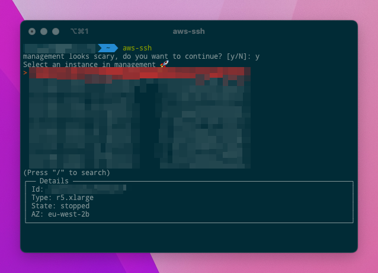

# AWS SSM Instance Selector
A simple tool for selecting instances in AWS to connect to using SSM

This tool is designed specifically to work in a bash like shell in Mac OS using AWS Vault as the main layer.
This could easily be adapted to be used elsewhere such as linux or in WSL with some tweaking to the file path.

If you don't want to use AWS-Vault then you can easily use AWS CLI on it's own you just need to change the CLI Commands in the script.

# Requirements
To connect to instances they will need to have the SSM agent installed and you will need to have the AWS SSM client installed
on your machine, this can be found [here](https://docs.aws.amazon.com/systems-manager/latest/userguide/session-manager-working-with-install-plugin.html).
You will also need to make sure that both the `click` and `simple_term_menu` python libraries are installed.

## Special Environments
You can customise the environments and how the script handles them by using the "special environments" section.
You can hide environments and you can make environments "scary" which makes you require confirmation before entering them.