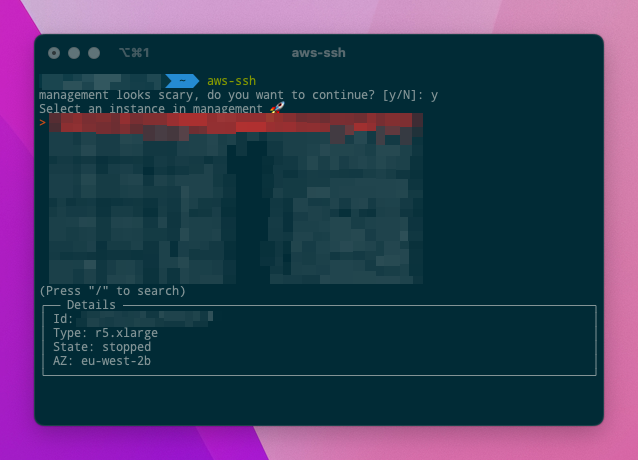

# AWS SSM Instance Selector
A simple tool for selecting instances in AWS to connect to using SSM

This tool is designed specifically to work in a bash like shell in Mac OS using [AWS Vault](https://github.com/99designs/aws-vault) as the main layer but you really don't *have* to use it as the script will default to AWS CLI only mode instead.
This could easily be adapted to be used elsewhere such as linux or in WSL with some tweaking to the file path.

If you don't want to use AWS-Vault then you can easily use AWS CLI on it's own you just need to change the CLI Commands in the script.

On running the script you will be asked to select the profile you want to login with but you can bypass this by setting the `AWS_PROFILE` environment variable
I do this by using the AWS plugin for Oh my zsh and this can let you set the profile using the `asp` command.



# Requirements
To connect to instances they will need to have the SSM agent installed and you will need to have the AWS SSM client installed
on your machine, this can be found [here](https://docs.aws.amazon.com/systems-manager/latest/userguide/session-manager-working-with-install-plugin.html).
You will also need to make sure that both the `click` and `simple_term_menu` python libraries are installed which you can do by using the requirements file:
```
pip3 install -r src/requirements.txt
```

## Installation
If you have a shell environment you can use the `install.sh` script below to put the latest local version of the script in your environment.

```
sudo chmod +x install.sh
sudo ./install.sh
```

## Special Environments
You can customise the environments and how the script handles them by using the "special environments" section.
You can hide environments and you can make environments "scary" which makes you require confirmation before entering them.